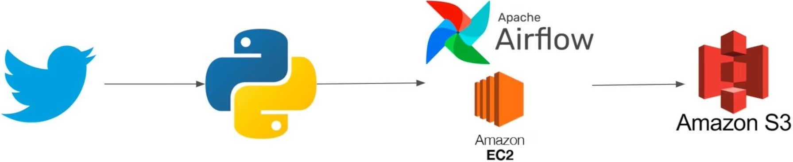
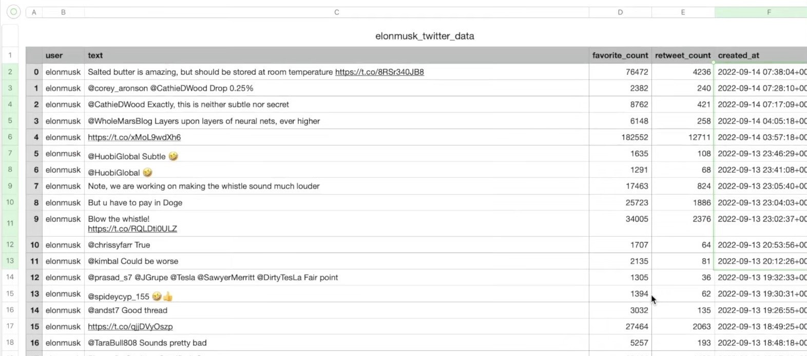

# Twitter-Airflow-Data-Engineering-Project

## Project Overview
This end-to-end data engineering project involves extracting data from the Twitter API, performing an ETL (Extract, Transform, Load) process using Apache Airflow on an Amazon EC2 instance, and ultimately storing the transformed data in an Amazon S3 bucket. This project demonstrates the full data pipeline, from data acquisition to storage, making it a comprehensive data engineering solution.

## Architecture Diagram
   

## Services Used
1. **Apache Airflow :** Apache Airflow is an open-source platform designed to programmatically author, schedule, and monitor workflows. It is particularly well-suited for orchestrating complex data workflows, automating tasks, and managing dependencies between different tasks or processes.
2. **Twitter API :** The Twitter API is a developer interface for accessing and interacting with Twitter's data and services. It enables tasks like posting tweets, following users, and retrieving tweets programmatically. Developers use it to build Twitter-related applications and perform data analysis.
3. **Amazon EC2 :** Amazon Elastic Compute Cloud (Amazon EC2) is a web service offered by Amazon Web Services (AWS) that provides resizable compute capacity in the cloud. It allows users to launch and manage virtual servers, known as EC2 instances, to run applications and workloads.
4. **Amazon S3 (Simple Storage Service) :** Amazon S3 is an object storage service known for its manufacturing scalability, data availability, security, and performance.
   
These services are integral to our project and will collectively support our data processing, storage, analysis, and reporting needs in an efficient and scalable manner.

## Project Execution Flow

### Data Extraction and Transformation
**Data Extraction from Twitter API :** The project begins with the extraction of data from the Twitter API using a custom ETL script. This script retrieves data based on specific queries or criteria.

**Data Transformation :** The extracted data, typically in JSON format, is transformed into a structured DataFrame (DF) format. This transformation includes cleaning, filtering, and organizing the data for further processing.

**Local Data Storage :** The transformed data is temporarily stored locally, serving as an intermediate repository.

### AWS EC2 and Airflow Deployment

**Creating an EC2 Instance :** An Amazon EC2 instance is launched on AWS. This instance provides a scalable and cloud-based environment for executing data processing tasks.

**IAM Role Configuration :** An IAM (Identity and Access Management) role is created and associated with the EC2 instance. This role grants the necessary permissions to access AWS resources, particularly for writing data to an Amazon S3 bucket.

**Security Group Setup :** The security group associated with the EC2 instance is configured to enable access, including SSH access, and establish necessary network settings.

**SSH Connection :** You connect to the EC2 instance using SSH, gaining remote access to the instance.

**Airflow Installation :** Apache Airflow, a workflow orchestration tool, is installed on the EC2 instance. Airflow is essential for defining, scheduling, and executing ETL workflows.

**DAG Creation :** A Directed Acyclic Graph (DAG) is created in Apache Airflow to represent the ETL workflow. The DAG defines the sequence of tasks, including data transformation and loading.

**Running the ETL Workflow :** The Apache Airflow scheduler is started, which triggers the ETL workflow, executing data transformation and loading tasks.

### Data Storage in Amazon S3
**Storing Transformed Data in Amazon S3 :** The final step of the ETL pipeline involves storing the processed data in an Amazon S3 bucket. Amazon S3 provides secure, durable, and scalable object storage for the data.

## Output Image
   

## Conclusion

In summary, this comprehensive data engineering project encompasses data extraction from Twitter, data transformation, local storage, EC2 setup, Apache Airflow deployment, ETL code integration, and data storage in an Amazon S3 bucket. It demonstrates a full end-to-end pipeline for handling and analyzing Twitter data.

